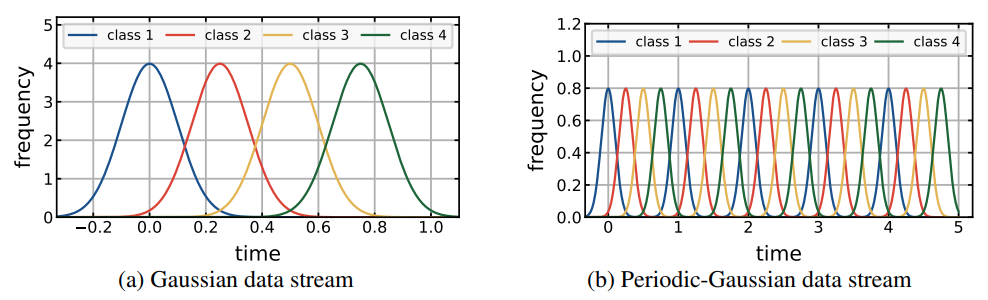
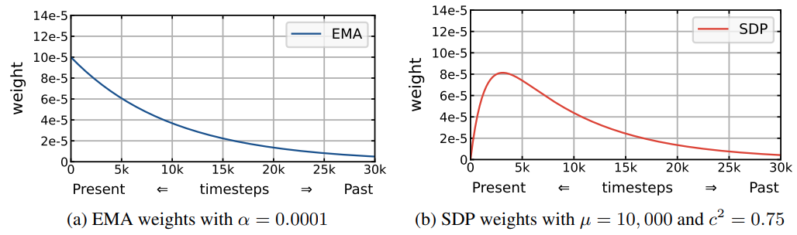

# The Official PyTorch Implementation of SDP (Scheduled Data Prior)

**Online Boundary-Free Continual Learning by Scheduled Data Prior** 
Hyunseo Koh, Minhyuk Seo, Jihwan Bang, Hwanjun Song, Deokki Hong, Seulki Park, Jung-Woo Ha, Jonghyun Choi 
ICLR 2023 

## Overview

### Abstract
Typical continual learning setup assumes that the dataset is split into multiple discrete tasks. We argue that it is less realistic as the streamed data would have no notion of task boundary in real-world data. Here, we take a step forward to investigate more realistic online continual learning – learning continuously changing data distribution without explicit task boundary, which we call boundary-free setup. As there is no clear boundary of tasks, it is not obvious when and what information in the past to be preserved as a better remedy for the stability-plasticity dilemma. To this end, we propose a scheduled transfer of previously learned knowledge. We further propose a data-driven balancing between the knowledge in the past and the present in learning objective. Moreover, since it is not straight-forward to use the previously proposed forgetting measure without task boundaries, we further propose a novel forgetting measure based on information theory that can capture forgetting. We empirically evaluate our method on a Gaussian data stream, its periodic extension, which assumes periodic data distribution frequently observed in real-life data, as well as the conventional disjoint task-split. Our method outperforms prior arts by large margins in various setups, using four popular benchmark datasets – CIFAR-10, CIFAR-100, TinyImageNet and ImageNet.

### Results
Results of CL methods on various datasets, for online continual learning on Gaussian Data Stream, measured by  metric.
For more details, please refer to our [paper](https://openreview.net/pdf?id=qco4ekz2Epm).

| Methods | CIFAR10        | CIFAR100       | TinyImageNet   | ImageNet  |
|---------|----------------|----------------|----------------|-----------|
| ER      | 55.97±0.85     | 36.93±0.77     | 21.78±0.76     | 24.16     |
| DER++   | 56.12±0.14     | 28.77±0.67     | 17.13±0.88     | 19.34     |
| ER-MIR  | 56.48±0.18     | 34.76±1.20     | 21.64±0.77     | 12.86     |
| GDumb   | 46.45±0.68     | 28.81±0.74     | 18.81±0.64     | 13.74     |
| CLIB    | 63.01±0.31     | 42.79±0.65     | 27.53±0.94     | 34.11     |
| SDP     | **66.51±0.42** | **46.34±0.64** | **30.49±0.69** | **35.52** |

## Getting Started
To set up the environment for running the code, you can either use the docker container, or manually install the requirements in a virtual environment.
### Using Docker Container (Recommended)
We provide the Docker image `khs8157/sdp` on Docker Hub.
To download the docker image, run the following command:
<pre>
docker pull khs8157/sdp:latest
</pre>
After pulling the image, you may run the container via following command:
<pre>
docker run --gpus all -it --shm-size=64gb -v <i>/PATH/TO/CODE</i>:<i>/PATH/TO/CODE</i> --name=<i>CONTAINER_NAME</i> khs8157/sdp:latest bash
</pre>
Replace the arguments written in <i>italic</i> with your own arguments.

### Requirements
- Python3
- Pytorch (>=1.9)
- torchvision (>=0.10)
- numpy
- pillow~=6.2.1
- torch_optimizer
- randaugment
- easydict
- pandas~=1.1.3

If not using Docker container, install the requirements using the following command
<pre>
pip install -r requirements.txt
</pre>

## Running Experiments

### Downloading the Datasets
CIFAR10, CIFAR100, and TinyImageNet can be downloaded by running the corresponding scripts in the `dataset/` directory.
ImageNet dataset can be downloaded from [Kaggle](https://www.kaggle.com/c/imagenet-object-localization-challenge).

### Experiments Using Shell Script
Experiments for the implemented methods can be run by executing `experiment.sh` by
<pre>
bash experiment.sh
</pre>
You may change various arguments for different experiments.
- `NOTE`: Short description of the experiment. Experiment result and log will be saved at `results/DATASET/NOTE`.
  - WARNING: logs/results with the same dataset and note will be overwritten!
- `MODE`: CL method to be applied. Methods implemented in this version are: [sdp, clib, er, mir, gdumb, der++]
- `DATASET`: Dataset to use in experiment. Supported datasets are: [cifar10, cifar100, tinyimagenet, imagenet]
- `REPEAT`: Number of periods in the Periodic Gaussian data stream. Set `REPEAT=1` for non-periodic case.
- `SIGMA`: Standard deviation of the Gaussian distribution in Gaussian and Periodic Gaussian data stream.
- `USE_AMP`: Use automatic mixed precision (amp), for faster running and reducing memory cost.
- `MEM_SIZE`: Maximum number of samples in the episodic memory.
- `ONLINE_ITER`: Number of model updates per sample.
- `EVAL_PERIOD`: Period of evaluation queries, for calculating .
- `F_PERIOD`: Period of evaluating knowledge gain/loss, for calculating KLR and KGR.

### Creating the Data Stream
We provide a jupyter notebook `make_stream.ipynb` to construct the data streams used in the experiment. You may create your own Boundary-Free data streams by modifying the distribution, period, and etc.

## Citation
If you used our code, SDP method, Boundary-Free setup, or KLR and KGR metric, please cite our paper.
<pre>
@inproceedings{koh2023online,
  title={Online Boundary-Free Continual Learning by Scheduled Data Prior},
  author={Koh, Hyunseo and Seo, Minhyuk and Bang, Jihwan and Song, Hwanjun and Hong, Deokki and Park, Seulki and Ha, Jung-Woo and Choi, Jonghyun},
  booktitle={ICLR},
  year={2023}
}
</pre>

## Acknowledgment
This work is partly supported by the NRF grant (No.2022R1A2C4002300), IITP grants (No.2020-0-01361-003, AI Graduate School Program (Yonsei University) 5%, No.2021-0-02068, AI Innovation Hub 5%, 2022-0-00077, 20%, 2022-0-00113, 20%, 2022-0-00959, 15%, 2022-0-00871, 15%, 2022-0-00951, 15%) funded by the Korea government (MSIT).
